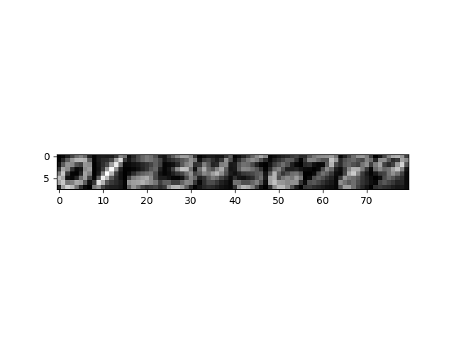
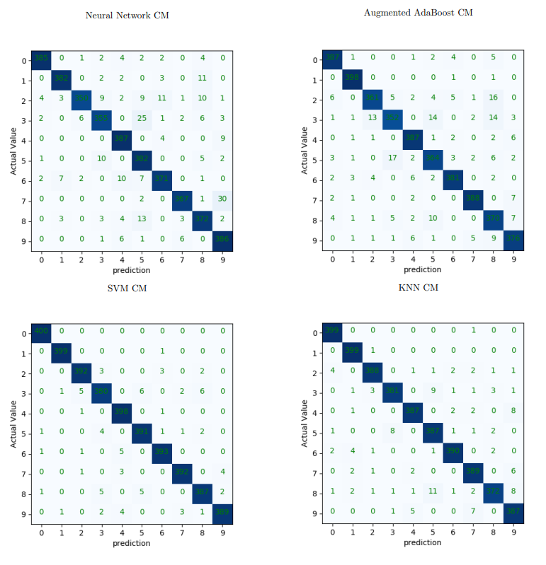
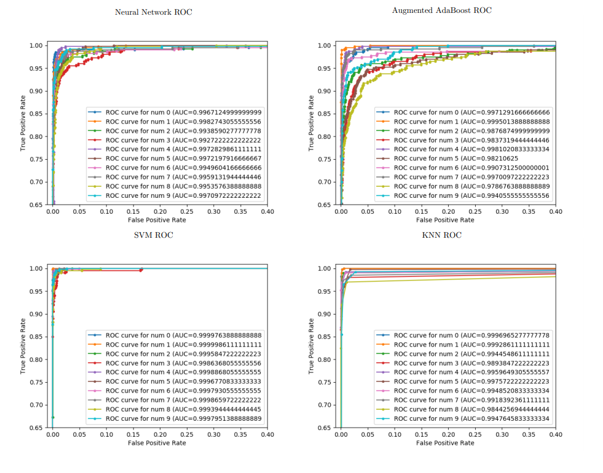

in this repo we explore KNN, NN, SVM, AdaBoost. On top we visualize the output using confusion matrix and ROC curves.

we note the more packed it is along the diagonal the better in this case we note all of them does well.  

we note the closer to an right angle the better the model in this case SVM seems to work really well.  

we also computed the regular accuracy, precision and recall in the terminal when the code is executed.